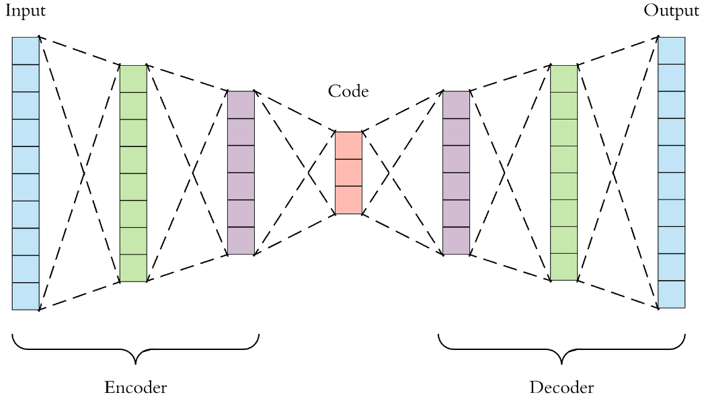
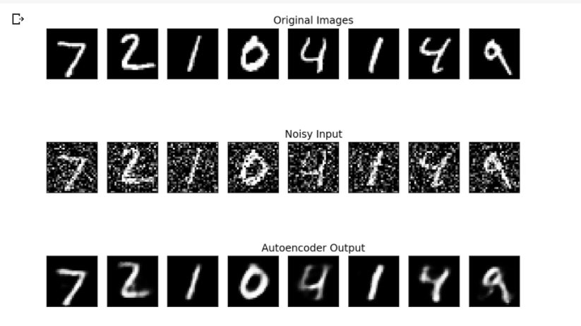
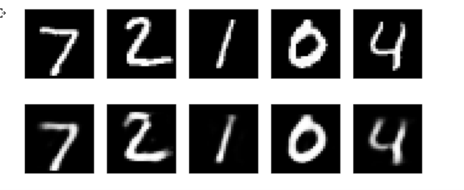

<!--Headings-->

> # *Autoencoders*

Autoencoder is an unsupervised artificial neural network that learns how to efficiently compress and encode data then learns how to reconstruct the data back from the reduced encoded representation to a representation that is as close to the original input as possible.

**Autoencoder, by design, reduces data dimensions by learning how to ignore the noise in the data.**

It consists of three parts :

1) **Encoder** : In which the model learns how to reduce the input dimensions and compress the input data into an encoded representation.

2) **Code** : The code is a compact “summary” or “compression” of the input, also called the latent-space representation.

3) **Decoder** : The decoder, which has the similar ANN structure, then produces the output only using the code. The goal is to get an output identical with the input. Note that the decoder architecture is the mirror image of the encoder. This is not a requirement but it’s typically the case. The only requirement is the dimensionality of the input and output needs to be the same. 

> ## Properties :

1) **Data Specific** : Autoencoders are only able to meaningfully compress data similar to what they have been trained on. So we can’t expect an autoencoder trained on handwritten digits to compress landscape photos.

2) **Lossy**: The output of the autoencoder will not be exactly the same as the input, it will be a close but degraded representation. If you want lossless compression they are not the way to go.

3) **Unsupervised**: To train an autoencoder we don’t need to do anything fancy, just throw the raw input data at it. Autoencoders are considered an unsupervised learning technique since they don’t need explicit labels to train on. But to be more precise they are self-supervised because they generate their own labels from the training data.

> ## Architecture :

- **Encoder** - Fully connected Artificial Neural Network.

- **Code** - Single Layer ANN.

- **Decoder**- Fully connected ANN symmetric to the encoder.

> ## *Different Types of Autoencoder*

> ### **Denoising Autoencoder**

- Keeping the code layer small forced our autoencoder to learn an intelligent representation of the data. There is another way to force the autoencoder to learn useful features, which is adding random noise to its inputs and making it recover the original noise-free data. This way the autoencoder can’t simply copy the input to its output because the input also contains random noise. We are asking it to subtract the noise and produce the underlying meaningful data. This is called a denoising autoencoder.

- We add random Gaussian noise to them and the noisy data becomes the input to the autoencoder. The autoencoder doesn’t see the original image at all. But then we expect the autoencoder to regenerate the noise-free original image.

### OUTPUT :

> ### **Sparse Autoencoder**

- The third method is using regularization. We can regularize the autoencoder by using a sparsity constraint such that only a fraction of the nodes would have nonzero values, called active nodes.

- In particular, we add a penalty term to the loss function such that only a fraction of the nodes become active. This forces the autoencoder to represent each input as a combination of small number of nodes, and demands it to discover interesting structure in the data. This method works even if the code size is large, since only a small subset of the nodes will be active at any time.

- We now add another parameter called activity_regularizer by specifying the regularization strength. This is typically a value in the range [0.001, 0.000001]. Here we chose 10e-6.

### Output :

> ## Conclusion

So these were the basics of the autoencoder. We discussed the properties, architecture and the implementation of the autoencoders. We also discussed denoising and the sparse autoencoders.

The code for all the autoencoders is in the github file.

